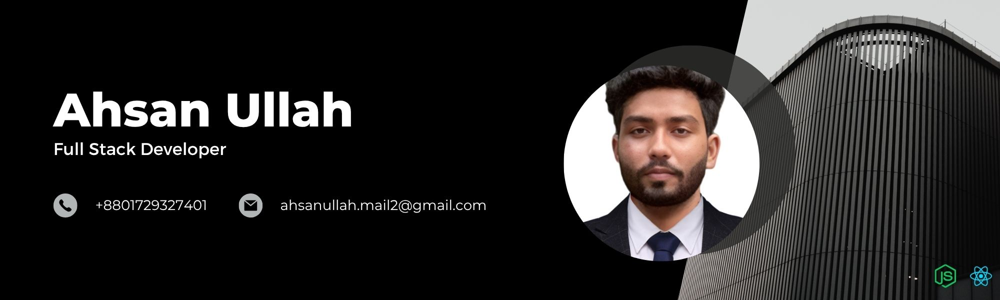

<!-- Add a custom background image -->

  

<h1 align="center">Hi there, I'm Ahsanullah 👋</h1>
<h3 align="center">Full Stack Developer | Creative Thinker | Problem Solver</h3>

---

### 🧠 About Me

As a passionate **Full Stack Developer** from **Barisal, Bangladesh**, I thrive on creativity and collaboration.  
I enjoy crafting elegant **front-end interfaces**, and I'm on a mission to **master backend development** and sharpen my **logical problem-solving** skills.  

💡 I believe in:
- Writing clean, efficient, scalable code
- Meeting deadlines with confidence
- Constantly learning and improving

---

### 🛠️ Tech Stack

#### ⚙️ Frontend

#### 🖥️ Backend

#### 🔐 Authentication

#### 🧰 Tools

---

### 📈 GitHub Stats

  
  

---

### 📫 Connect With Me

- 📍 Barisal, Bangladesh  
- 📧 [ahsanullah.mail2@gmail.com](mailto:ahsanullah.mail2@gmail.com)  
- 📱 01729327401
